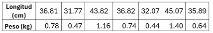
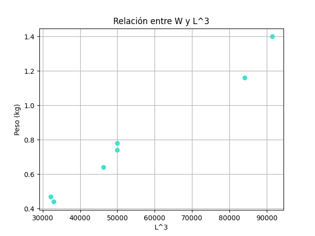
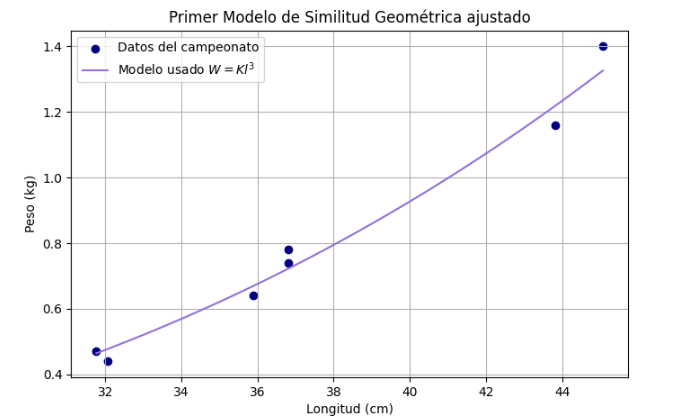

# Práctica 5: Modelos de Similitud Geométrica

**El Problema del Campeonato de Pesca De Róbalo**

Imaginemos que la competencia premia al pez más pesado, pero la única herramienta con la que contamos para determinar el peso de los peces es una cinta métrica. Como en las versiones anteriores del campeonato asistieron miles de participantes queremos poder predecir el peso de un pescado en término de algunas dimensiones fáciles de medir. A pesar de que el peso de un pescado se ve afectado por variables como la forma del pescado, la densidad del pescado, la edad del pescado, entre otras, haremos un modelo que dependa solo de variables medibles por nuestra cinta métrica. Algunos de los supuestos que usaremos en nuestro modelo son que:

• La especie está fija y todos los pescados serán robalos. (En general esto sí sucede en los campeonatos).

• La densidad de los pescados es constante. (Esto es poco realista pero nos servirá para un primer modelo).

• Las variables como la estación del año, el sexo, la edad, etc. no afectan al peso del róbalo.

• Los róbalos son geométricamente similares.

Ahora, recordando que la densidad (ρ) es igual a la masa entre el volumen, podemos calcular el peso (W) de un pescado multiplicando su volumen por su densidad:

$W =V ⋅ ρ$

Ahora, bajo nuestro supuesto de densidad constante y de similitud geométrica tenemos que

$W \propto V$

$W \propto l ^3$

A continuación pondremos a prueba nuestro primer modelo.

Nota:

• La masa corresponde a la cantidad de materia que compone un objeto determinado.

• El peso, en cambio, corresponde a la fuerza resultante de la acción que ejerce la gravedad de la Tierra (en nuestro caso).

## Integrantes

- Herrera Barrera Joyce
- Pulido Pérez José Antonio
- Rodríguez Rodríguez Diego

## Uso e instalación

(Si no eliminas esta línea lloro) Aquí escribe qué necesitas que instale para ejecutar tu código, por ejemplo:

- `matplotlib`

(Si no eliminas esta línea lloro) Y dime cómo debería ejecutar tu código y en qué orden. Recuerda que antes de ejecutar tu código leeré tu `README.md`. Por ejemplo la manera en la que propongo que organizes tu código es

- `main.py`: Contiene el código para graficar cada uno de los tres ejercicios
- `` (Por favor modifica esta línea)

## Ejercicio 1
Para poder ajustar nuestro modelo necesitamos datos sobre el peso $(W)$ y la longitud $(l)$ de algunos pescados. Los únicos datos sobrevivientes de los campeonatos anteriores se encuentran en la siguiente tabla: 

En realidad, lo que medimos cuando "pesamos" en kg es la masa, y no el peso, de lo que estemos midiendo. 

Graficamos los datos de esta tabla de acuerdo a la relación:

$W \propto l ^3$

(Por favor modifica esta línea, lo suplico por piedad) Aquí puedes colocar la discusión del modelo, tu interpretación, el efecto de las condiciones iniciales. No tiene que ser perfecto, pero entre más casos puedas cubrir mejor

## Ejercicio 2

Utiliza los datos anteriores y el método de tu preferencia para estimar un buen valor de $K$ para nuestro modelo de similaridad geométrica $W = Kl^3$. Grafica la estimación contra los datos. 

¿Qúe tan bueno es el ajuste? ¿Hay algún efecto que nuestro modelo no capture?

*Modelo ajustado: $W = 1.45 \times 10^{-5} \cdot l^3$*

*Coeficiente de correlación $(r): 0.9907$*

## Ejercicio 3

# Coeficiente de correlación de Pearson

Ahora añadiremos una dimensión extra a nuestra tabla anterior. Supongamos que además de los datos anteriores también tenemos disponible la circunferencia máxima de cada pez.

Realice el ajuste del nuevo modelo en términos de la circunferencia ¿Cómo queda la fórmula explicita del modelo?¿Qué tan bueno es el ajuste?

### También puedes agregar tablas y eliminar este sub encabezado

| Elimíname | Elimíname a mí también |
| -------------- | --------------- |
| $1$ | $54$ |
| $2$ | $1000$ |

(Si no eliminas esta línea lloro) Y luego puedes comentar que con base en la tabla anterior, se ve una explosión en los valores a partir del tiempo $t=2$. 

## Conclusión

(Por favor modifica esta línea bro, es la última que tienes que modificar bro, por favor bro) Es buena práctica concluir tus prácticas. ¿Qué te llevas? ¿Sientes que fue relevante para ti? ¿Se te complicó algún aspecto? ¿Hubo algún resultado que contradijera tu intuición? 

---

[^1]: Sólo soy una nota al pie, elimíname bro, por favor bro.
